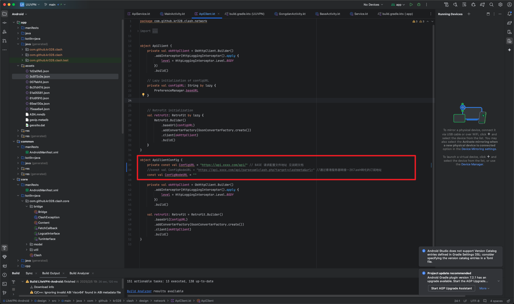

## UUVPN

[https://youtube.com/shorts/zI1hrpFJbtg?feature=share](https://youtube.com/shorts/zI1hrpFJbtg?feature=share)
 
### Requirement

- Android 5.0+ (minimum)
- Android 7.0+ (recommend)
- `armeabi-v7a` , `arm64-v8a`, `x86` or `x86_64` Architecture


### Build

1. Update submodules

   ```bash
   git submodule update --init --recursive
   ```

2. Install **OpenJDK 11**, **Android SDK**, **CMake** and **Golang**

3. Create `local.properties` in project root with

   ```properties
   sdk.dir=/path/to/android-sdk
   ```

4. Create `signing.properties` in project root with

   ```properties
   keystore.path=/path/to/keystore/file
   keystore.password=<key store password>
   key.alias=<key alias>
   key.password=<key password>
   ```

5. Build

   ```bash
   ./gradlew app:assembleMeta-AlphaRelease
   ```


6. 教程:修改 API 后台地址，api请求内容如下 , 可选增加订阅地址转换地址，方便调用。

Please read 服务器配置+Kotlin-Android 文档教程.docx



```
返回值可以直接写在阿里云oss 中，速度更快
{
  "baseURL": "https://api.0008.uk/api/v1/",
  "baseDYURL": "https://api.gooapis.com/api/vpnnodes.php",
  "mainregisterURL": "https://lelian.app/#/register?code=",
  "paymentURL": "xxxxx",
  "telegramurl": "https://t.me/fastlink",
  "kefuurl": "https://gooapis.com/fastlink/",
  "websiteURL": "https://gooapis.com/fastlink/",
  "crisptoken": "5546c6ea-4b1e-41bc-80e4-4b6648cbca76",
  "banners": [
    "https://image.gooapis.com/api/images/12-11-56.png",
    "https://image.gooapis.com/api/images/12-44-57.png",
    "https://image.gooapis.com/api/images/12-47-03.png"
  ],
  "message": "OK",
  "code": 1
}
```


```
测试的 URL 配置地址： https://vungles.com/api/test/config 
测试账号：
binance3980@gmail.com
Tinkl123
```

上面字段的意思：
以下是您提供的 JSON 配置文件的字段解释：

### 1. **baseURL**
   - **描述**：基础 API URL，用于访问主要的 API 端点。
   - **示例值**：`https://api.0008.uk/api/v1/`
   - **用途**：所有与服务器的 API 请求都将基于此 URL 进行。例如，可以在此基础上附加不同的 API 路径来访问特定资源。

### 2. **baseDYURL**
   - **描述**：另一个 API URL，与 `baseURL` 不同，用于访问特定的 VPN默认测试节点。
   - **示例值**：`https://api.gooapis.com/api/vpnnodes.php`
   - **用途**：通常用于请求特定的 VPN 节点数据或其他与代理/网络连接相关的信息。

### 3. **mainregisterURL**
   - **描述**：用户注册页面推广的 URL，通常包含一个唯一的代码参数，用于推广注册过程。
   - **示例值**：`https://lelian.app/#/register?code=`
   - **用途**：这个 URL 用于引导用户进行注册，`code` 参数可能是用户的注册邀请码或其他标识符。

### 4. **paymentURL**
   - **描述**：支付相关的 URL，可能指向支付网关或交易页面。
   - **示例值**：`xxxxx`
   - **用途**：用于支付的跳转链接，具体地址没有提供。

### 5. **telegramurl**
   - **描述**：指向 Telegram 频道或群组的 URL。
   - **示例值**：`https://t.me/fastlink`
   - **用途**：用户可以通过此链接访问 Telegram 频道，可能用于接收通知、更新或客服支持。

### 6. **kefuurl**
   - **描述**：客服支持页面的 URL。
   - **示例值**：`https://gooapis.com/fastlink/`
   - **用途**：提供给用户访问的在线客服页面，通常是支持问题解答和帮助解决问题的页面。

### 7. **websiteURL**
   - **描述**：指向网站首页的 URL。
   - **示例值**：`https://gooapis.com/fastlink/`
   - **用途**：指向官方网站，用户可以通过该链接访问相关产品或服务的详细信息。

### 8. **crisptoken**
   - **描述**：一个唯一的令牌，通常用于身份验证或授权。
   - **示例值**：`5546c6ea-4b1e-41bc-80e4-4b6648cbca76`
   - **用途**：令牌用于验证请求的合法性，防止未经授权的访问。可能用于 API 请求中传递身份信息。

### 9. **banners**
   - **描述**：一个包含多个图片 URL 的数组，通常用于在网页或应用中展示横幅广告或图片。
   - **示例值**：
     ```json
     [
       "https://image.gooapis.com/api/images/12-11-56.png",
       "https://image.gooapis.com/api/images/12-44-57.png",
       "https://image.gooapis.com/api/images/12-47-03.png"
     ]
     ```
   - **用途**：这些链接指向可以展示在前端界面上的横幅图片，可以是广告、通知、促销等。

### 10. **message**
   - **描述**：一个消息字段，通常用于描述当前操作或请求的状态。
   - **示例值**：`OK`
   - **用途**：这是 API 响应中的状态信息，`OK` 表示操作成功。

### 11. **code**
   - **描述**：一个数字代码，表示响应的状态。
   - **示例值**：`1`
   - **用途**：通常用于表示请求是否成功，`1` 可能表示操作成功，其他数字可能表示错误或特定的状态。
