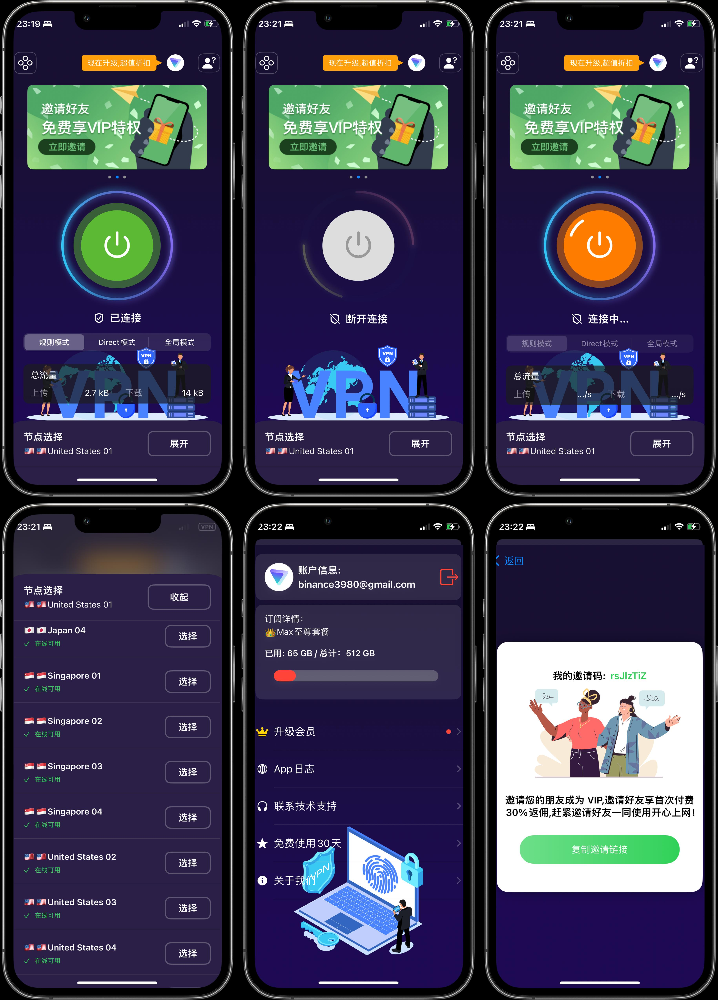

# UUVPN


UUVPN - Redesigned for Performance and Stability
The original UUVPN was built using Flutter, but maintaining the codebase became increasingly difficult due to performance issues, poor UI quality, and lack of stability. As a result, we decided to completely redevelop UUVPN, focusing on native performance for iOS/macOS and Android by using the SINGBOX and CLASH cores respectively.

The new version delivers a more responsive user interface, enhanced stability, and significant performance improvements.

## Features:
Seamless Connectivity: Built on the powerful SINGBOX and CLASH cores for efficient and secure connections.
Improved UI: Redesigned with a sleek, modern interface optimized for user experience.
Cross-Platform: Available for iOS, macOS, and Android.
Stability: Improved app architecture ensures a more reliable performance.

## Preview
Check out the demo video and screenshots below:




## Screenshots:
<table>
  <tr>
    <td></td>
   <td></td>
   <td></td>
  </tr>
 
  
</table>


-------------------------------过去 UUVPN 的老代码 分界线-------------------------------------


# UUVPN 
基于Flutter开发的VPN客户端(ios/android)，自主设计，精美UI,优化VPN速度，完全开源。

A VPN application for [V2Board](https://github.com/v2board/v2board)  

Support iOS and Android now.


 
**IF THIS PROJECT HELPS YOU, PLEASE GIVE ME A LITTLE STAR⭐️.**

## Screenshots


## App Store 

 

## Environment

- Flutter Flutter 3.10.1 • channel stable • https://github.com/flutter/flutter.git
    Framework • revision d3d8effc68 (6 weeks ago) • 2023-05-16 17:59:05 -0700
    Engine • revision b4fb11214d
    Tools • Dart 3.0.1 • DevTools 2.23.1
    - Download this version url: https://drive.google.com/file/d/1ksM4_PK9Ibk7ycyrfF7XffM_99_4JYV3/view?usp=sharing
    - leaf sdk downlaod url: https://github.com/eycorsican/leaf/releases/tag/v0.10.7

- macOS 13.3.1 +
- Xcode 14 +
- iOS 15.0 +

## Installation

```shell
flutter pub get
```

## Develop
```shell
flutter run
```

## Build
build android apk
```shell
flutter build apk
```

build ios
```shell
flutter build ios
```

---------------------- 

# How to use it?


- 1:  Change Domain File Path : ~UUVPN/flutter/lib/constant/app_urls.dart
  ```
    static const String baseUrl = "https://xxxx.com";
  ```

- 2: Xcode Settings:


 

- 3: running screenshot:

