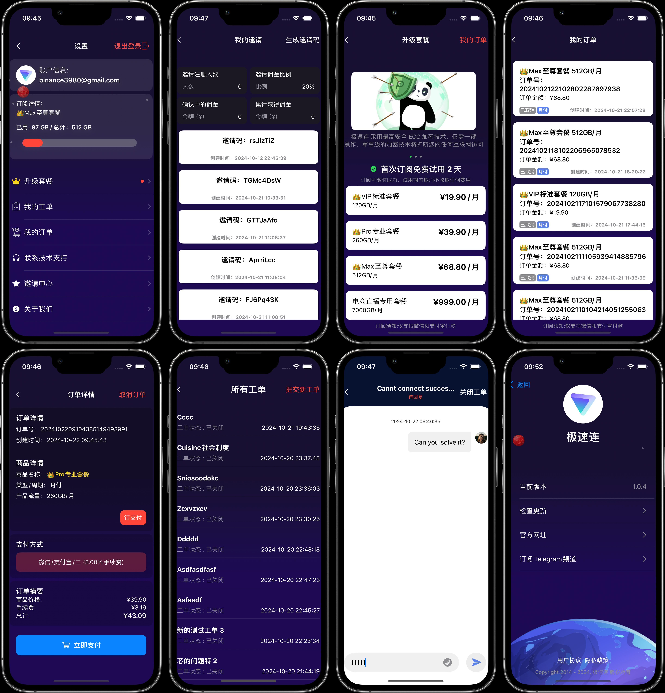
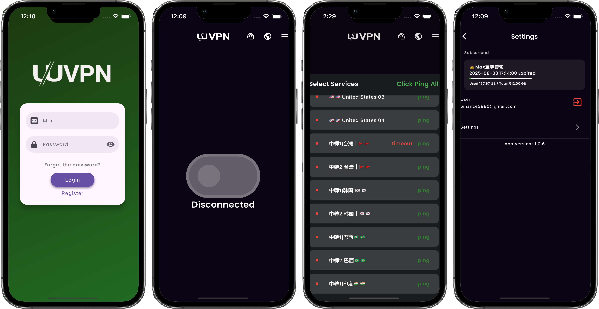

## UUVPN - Redesigned for Performance, Stability, and V2Board Compatibility

The original UUVPN was built using Flutter, which led to increasing challenges in maintaining the codebase due to performance issues, subpar UI quality, and a lack of stability. To address these concerns, UUVPN has been completely redeveloped for native performance on iOS/macOS and Android, utilizing the powerful SINGBOX and CLASH cores.

### The new version features:

- A sleek, more responsive user interface
- Enhanced app stability
- Significant performance optimizations
- Additionally, UUVPN now supports server backend protocols with full compatibility for V2Board, providing a more seamless and flexible user experience for VPN management.

### Key Features:
- Native Performance: Utilizing SINGBOX for iOS/macOS and CLASH for Android, UUVPN is optimized for stability and speed.
- V2Board Compatibility: Fully supports V2Board protocols, offering smooth integration for backend management.
- Refined UI: A completely redesigned interface with a modern look and feel, providing a user-friendly experience.

## Screenshots and Demo Video:
<table>
  <tr>
    
   <td></td>
   <td></td>
   <td></td>
  </tr>  
 
</table>



## Screenshots:
<table>
  <tr>
    <td></td>
   <td></td>
   <td></td>
  </tr>  
</table>


# Legacy Version (Original Flutter-based UUVPN)
The following section contains information about the original Flutter-based UUVPN for historical reference. If you need the source code, you can check out the **flutter** branch

<details> <summary>Click to view the legacy version details</summary>
# Old Description:
  


# UUVPN 
基于Flutter开发的VPN客户端(ios/android)，自主设计，精美UI,优化VPN速度，完全开源。

A VPN application for [V2Board](https://github.com/v2board/v2board)  

Support iOS and Android now.


 
**IF THIS PROJECT HELPS YOU, PLEASE GIVE ME A LITTLE STAR⭐️.**

## Screenshots


## App Store 

 

## Environment

- Flutter Flutter 3.10.1 • channel stable • https://github.com/flutter/flutter.git
    Framework • revision d3d8effc68 (6 weeks ago) • 2023-05-16 17:59:05 -0700
    Engine • revision b4fb11214d
    Tools • Dart 3.0.1 • DevTools 2.23.1
    - Download this version url: https://drive.google.com/file/d/1ksM4_PK9Ibk7ycyrfF7XffM_99_4JYV3/view?usp=sharing
    - leaf sdk downlaod url: https://github.com/eycorsican/leaf/releases/tag/v0.10.7

- macOS 13.3.1 +
- Xcode 14 +
- iOS 15.0 +

## Installation

```shell
flutter pub get
```

## Develop
```shell
flutter run
```

## Build
build android apk
```shell
flutter build apk
```

build ios
```shell
flutter build ios
```

---------------------- 

# How to use it?



- 1:  Change Domain File Path : ~UUVPN/flutter/lib/constant/app_urls.dart
  ```
    static const String baseUrl = "https://xxxx.com";
  ```

- 2: Xcode Settings:


 

- 3: running screenshot:

