 

  

    
  

 

  
  <h1><a href="https://www.uuvpn.com/" target="_blank">UUVPN🪜</a></h1>

## An VPN app for iOS and Android that supports all [V2Board](https://github.com/cedar2025/Xboard)  servers

[![][license-shield]][license-link] [![][docs-shield]][docs-link] [![][github-release-shield]][github-release-link] [![][github-stars-shield]][github-stars-link]

English | [简体中文](README-zh_CN.md)

 
 

## What is UUVPN?
UUVPN  is a **native performance** on iOS/macOS and Android, utilizing the powerful SINGBOX and CLASH(mihomo) cores.

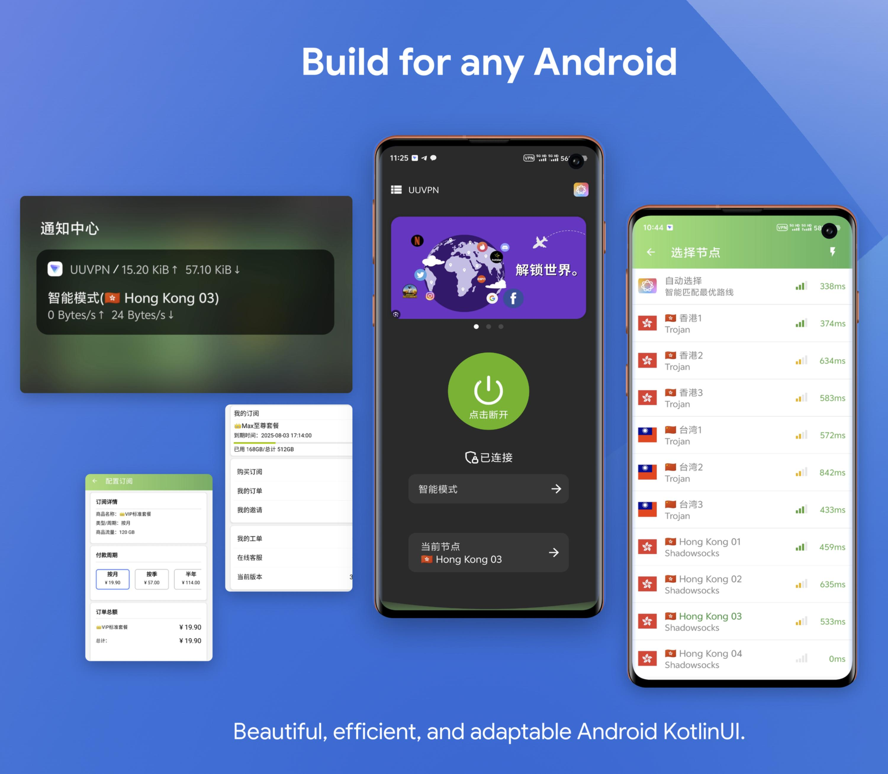

[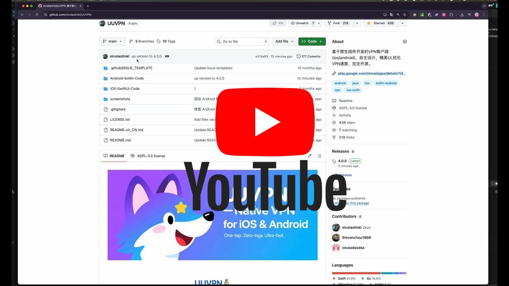](https://www.youtube.com/watch?v=ApWpUrYRINg)

 
### The new version features:

- A sleek, more responsive user interface
- Enhanced app stability
- Significant performance optimizations
- Additionally, UUVPN now supports server backend protocols with full compatibility for V2Board, providing a more seamless and flexible user experience for VPN management.

### Key Features:
- Native Performance: Utilizing SINGBOX for iOS/macOS and CLASH for Android, UUVPN is optimized for stability and speed.
- V2Board Compatibility: Fully supports V2Board protocols, offering smooth integration for backend management.
- Refined UI: A completely redesigned interface with a modern look and feel, providing a user-friendly experience.

### Server : 
- https://github.com/cedar2025/Xboard
This interface address is used to handle the core functions of UUVPN, including user authentication, configuration acquisition, and connection management.

  #### Protocol compatibility
  The iOS and Android versions of UUVPN are highly compatible with servers based on the https://github.com/cedar2025/Xboard series, and support the following common protocols:
  
  - Shadowsocks: Provides a secure SOCKS5 proxy that supports encrypted transmission.
  
  - VMess: Supports multiple transmission methods (such as TCP, WebSocket, QUIC, etc.), suitable for high-performance scenarios.
  
  - VLESS: A lightweight protocol with strong compatibility, supporting transmissions such as TCP, WebSocket, and gRPC.
  
  - Trojan: Simulates HTTPS traffic, supports TLS encryption, and provides high concealment.
  
  - SOCKS5: A standard proxy protocol that supports TCP and UDP traffic.
  HTTP/HTTPS: Supports HTTP proxy and HTTPS encrypted connection.
 
  * The iOS and Android versions of UUVPN are consistent with the server implementation of the Xboard series, and theoretically support all Xboard-compatible protocol configurations.
  Specific protocol support may depend on the configuration of the server side, please ensure that the relevant protocols are correctly enabled on the server side.
  For special protocols (such as TUIC or Hysteria), you need to confirm whether the server side has deployed support.
  - Compatibility Notes
  Cross-platform consistency: iOS and Android versions use the same server interface address to ensure that users get a consistent experience on different devices.
  Version compatibility: UUVPN's client is backward compatible with the Xboard-based server version and is suitable for most Xboard series deployments.
  Extensibility: If you need to support other protocols (such as WireGuard or Hysteria2), please refer to the Xboard documentation for server-side configuration adjustments. *

### Download iOS and android 
- [iOS TestFlight (Beta)](https://t.me/dcgzeus)
- [Android Apk](https://github.com/nicolastinkl/UUVPN/releases) 

##  iOS  Screenshots and Demo Video:

### SKIN 1:
<table>
  <tr>
    
   <td>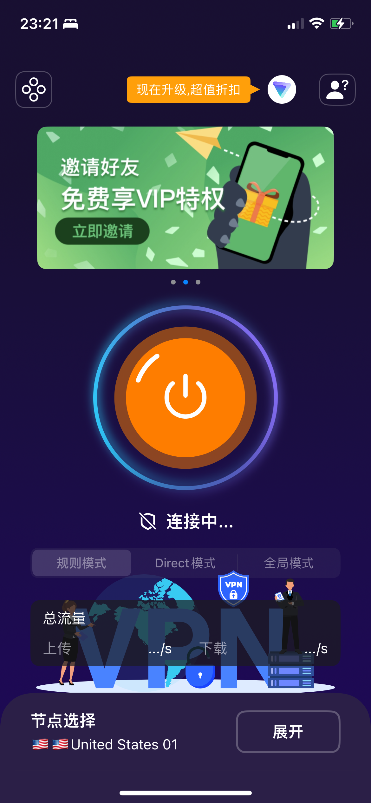</td>
   <td>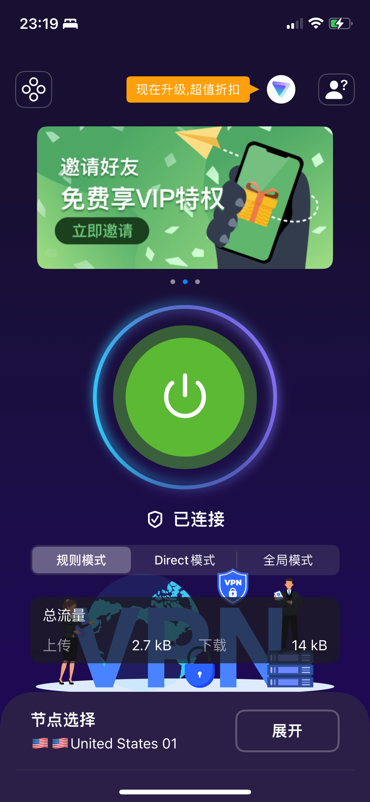</td>
   <td>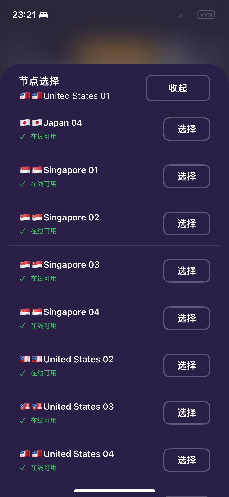</td>
  </tr>  

 </table>
 

### SKIN 2:

<table>

  <tr>
    
   <td>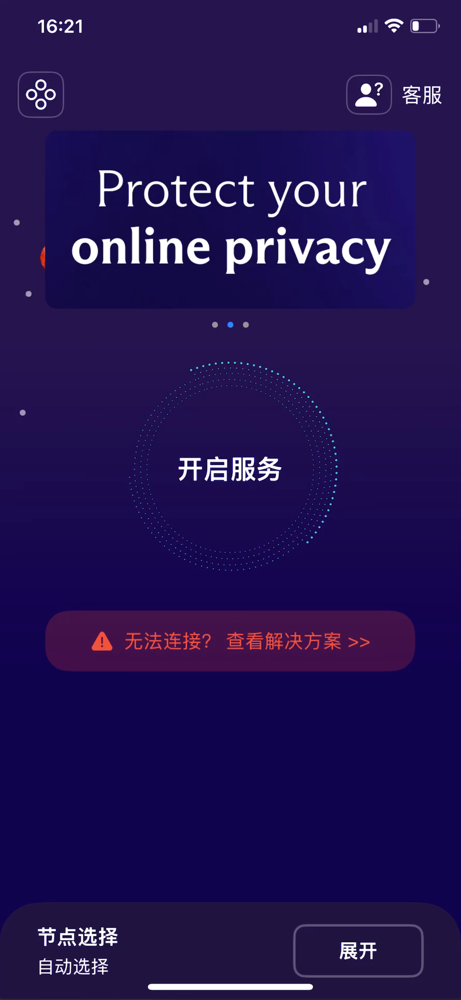</td>
   <td>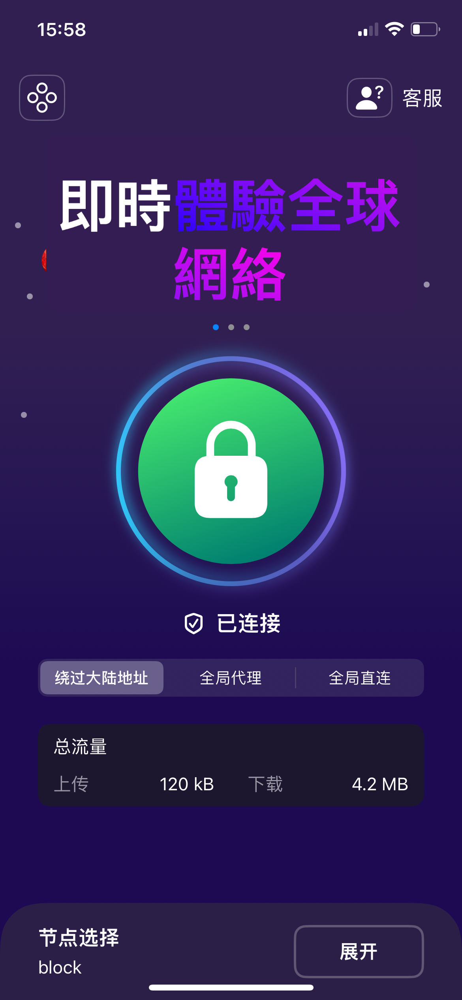</td>
   <td>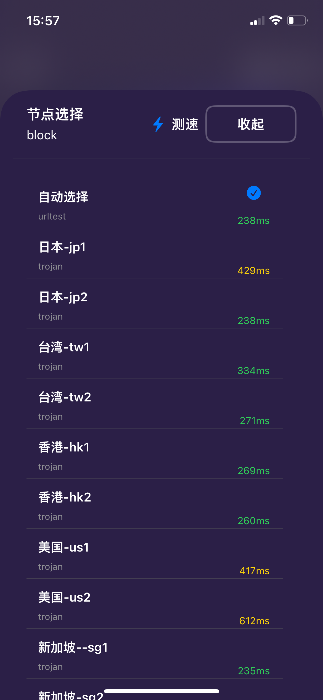</td>
  </tr>  

</table>

### LOGIC VIEWS:

<table>

  <tr>
    
   <td>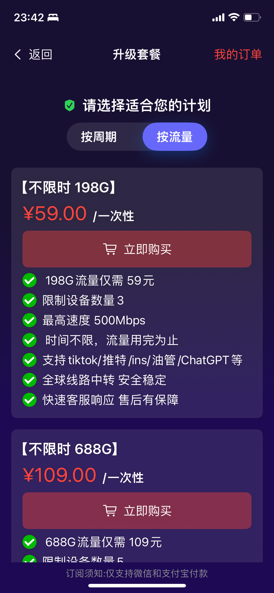</td>
   <td>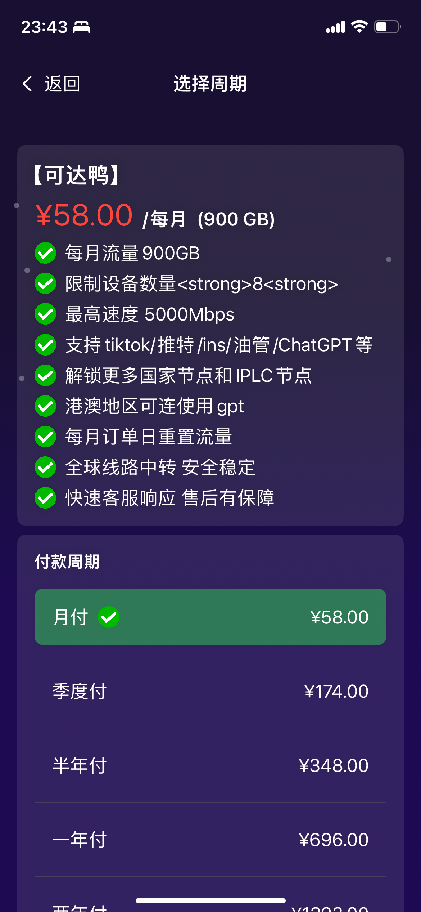</td>
   <td>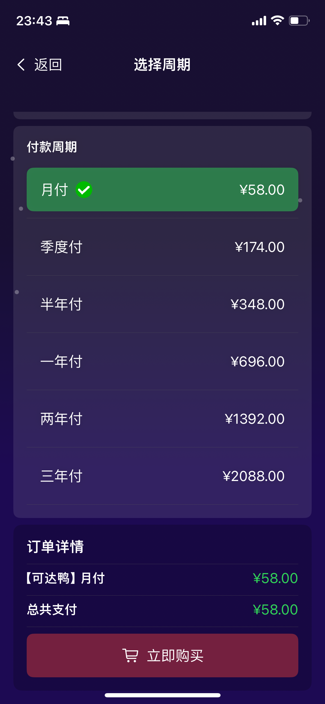</td>
  </tr>  

  <tr>
    
   <td>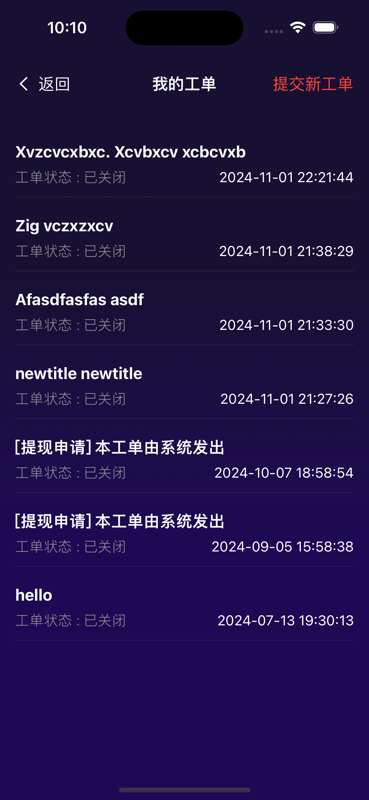</td>
   <td>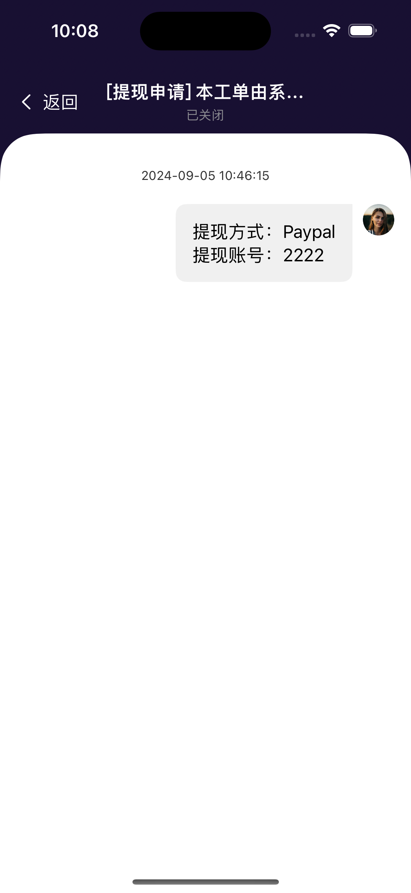</td>
   <td>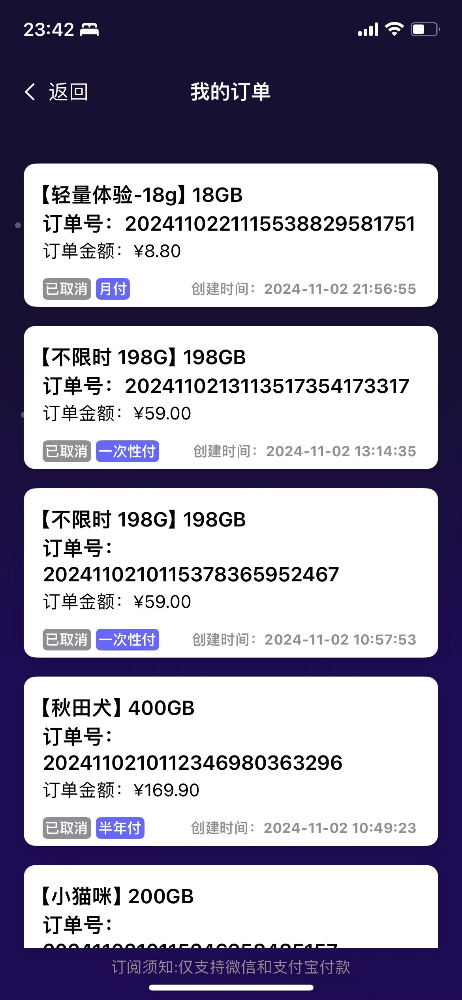</td>
  </tr>  

</table>

 

## Vidos:
<table>
  <tr>
  <td></td>
   <td></td>
   <td></td>

  </tr>  
</table>

## [iOS Youtube](https://www.youtube.com/shorts/tnr38-IM-Xo)
 

# Android App Project

## [Android Youtube](https://youtube.com/shorts/zI1hrpFJbtg?feature=share)
 
 
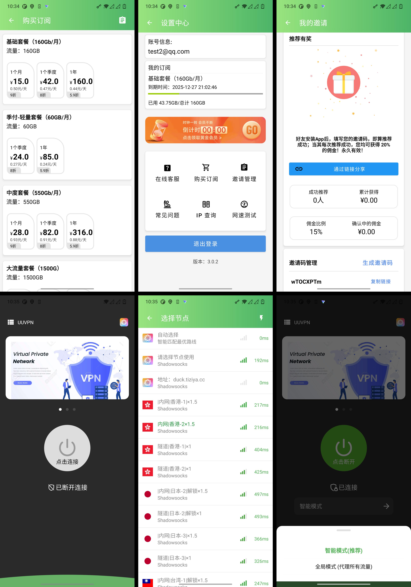
## Prerequisites

Before you begin, ensure you have met the following requirements:

- **Operating System**: Any system that supports Android development (Windows, macOS, Linux).
- **Java Development Kit (JDK)**: JDK 11 or higher.
- **Android Studio**: The official IDE for Android development, version 4.1 or higher.
- **Android SDK**: The latest version of the Android SDK tools.
- **Go**: go version go1.23.2 darwin/amd64

## License

UUVPN is licensed under the **AGPLv3 License**. This means you can:

✅ Use the software for free.  
✅ Modify and distribute the code.  
✅ Use it privately without restrictions.

See the [LICENSE](LICENSE) file for more details.

---
 

<!-- UUVPN Other link-->
[license-link]: https://www.gnu.org/licenses/agpl-3.0.html 

<!-- Shield link-->
[license-shield]: https://img.shields.io/badge/License-MIT-blue.svg
[license-link]: https://github.com/nicolastinkl/UUVPN/blob/main/LICENSE
[docs-shield]: https://img.shields.io/badge/Docs-Latest-green.svg
[docs-link]: https://github.com/cedar2025/Xboard/blob/master/docs
[github-release-shield]: https://img.shields.io/github/v/release/nicolastinkl/UUVPN
[github-release-link]: https://github.com/nicolastinkl/UUVPN/releases
[github-stars-shield]: https://img.shields.io/github/stars/nicolastinkl/UUVPN
[github-stars-link]: https://github.com/nicolastinkl/UUVPN/stargazers