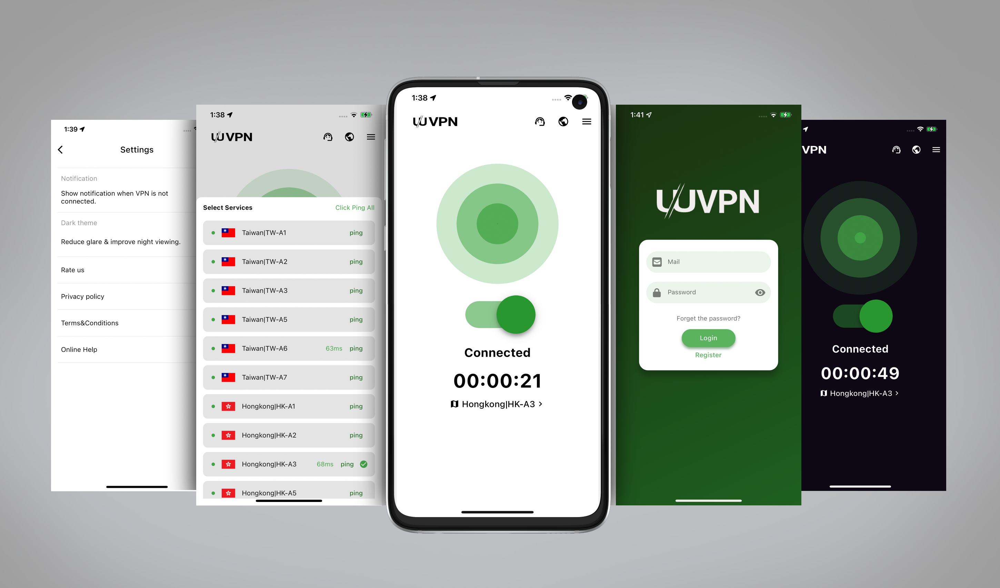
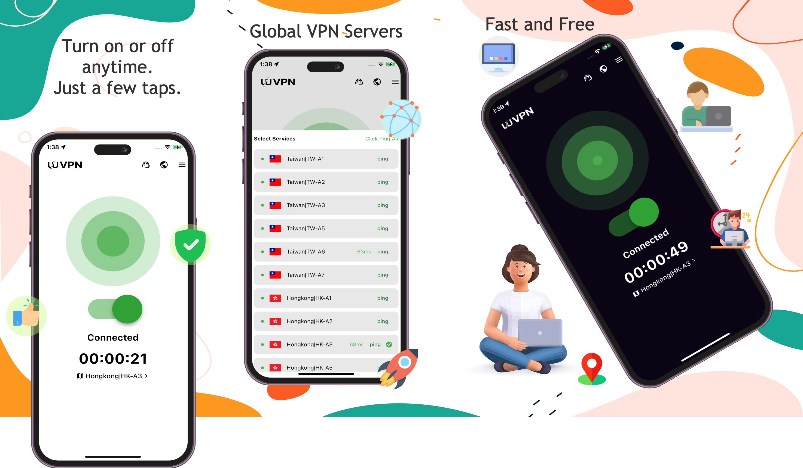
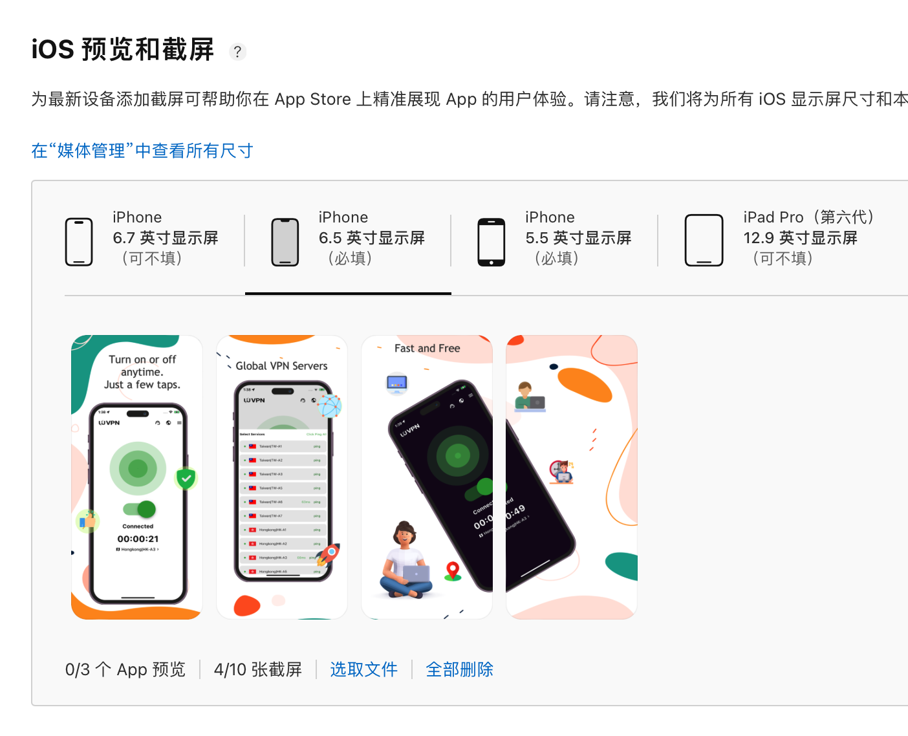
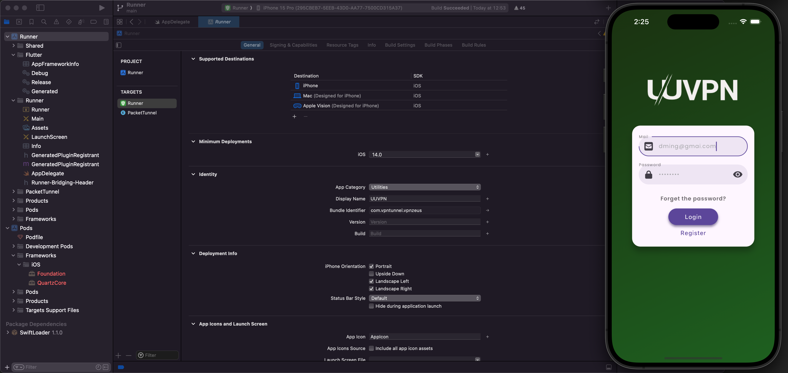
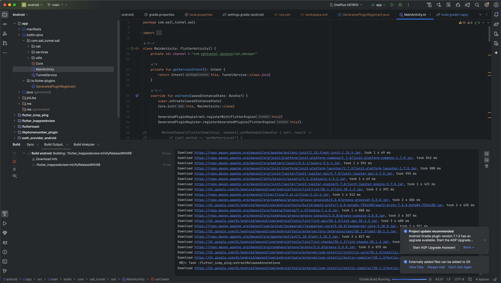
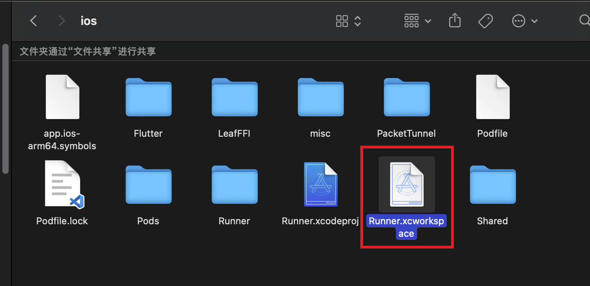
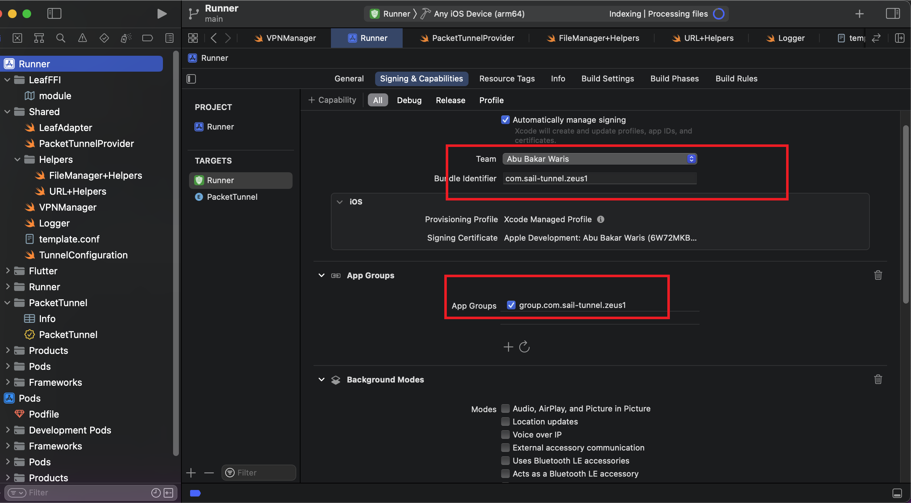
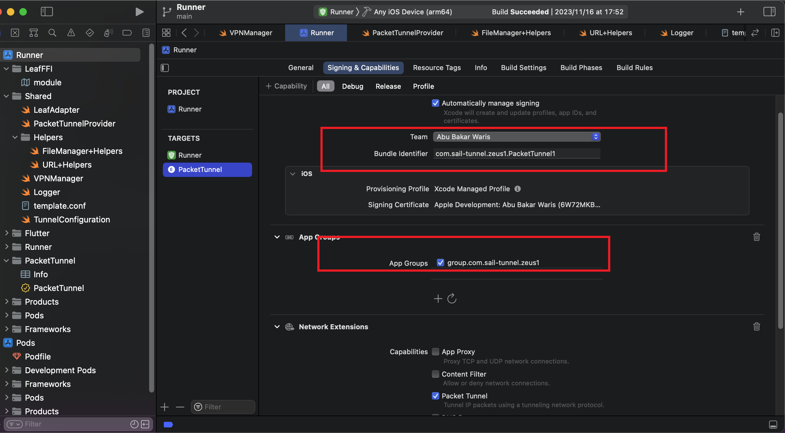
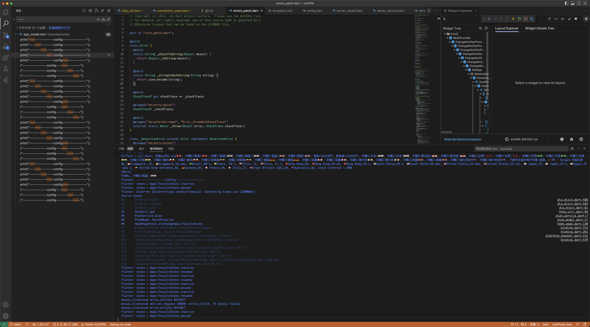

# UUVPN
基于Flutter开发的VPN客户端(ios/android)，自主设计，精美UI,优化VPN速度，完全开源。




# UUVPN 


A VPN application for [V2Board](https://github.com/v2board/v2board)  

Support iOS and Android now.


 
**IF THIS PROJECT HELPS YOU, PLEASE GIVE ME A LITTLE STAR⭐️.**

## Screenshots


## App Store 

 

## Environment

- Flutter Flutter 3.10.1 • channel stable • https://github.com/flutter/flutter.git
    Framework • revision d3d8effc68 (6 weeks ago) • 2023-05-16 17:59:05 -0700
    Engine • revision b4fb11214d
    Tools • Dart 3.0.1 • DevTools 2.23.1
    - Download this version url: https://drive.google.com/file/d/1ksM4_PK9Ibk7ycyrfF7XffM_99_4JYV3/view?usp=sharing
    - leaf sdk downlaod url: https://github.com/eycorsican/leaf/releases/tag/v0.10.7

- macOS 13.3.1 +
- Xcode 14 +
- iOS 15.0 +

## Installation

```shell
flutter pub get
```

## Develop
```shell
flutter run
```

## Build
build android apk
```shell
flutter build apk
```

build ios
```shell
flutter build ios
```

---------------------- 

# How to use it?




- 1:  Change Domain File Path : ~UUVPN/flutter/lib/constant/app_urls.dart
  ```
    static const String baseUrl = "https://xxxx.com";
  ```

- 2: Xcode Settings:





- 3: running screenshot:

